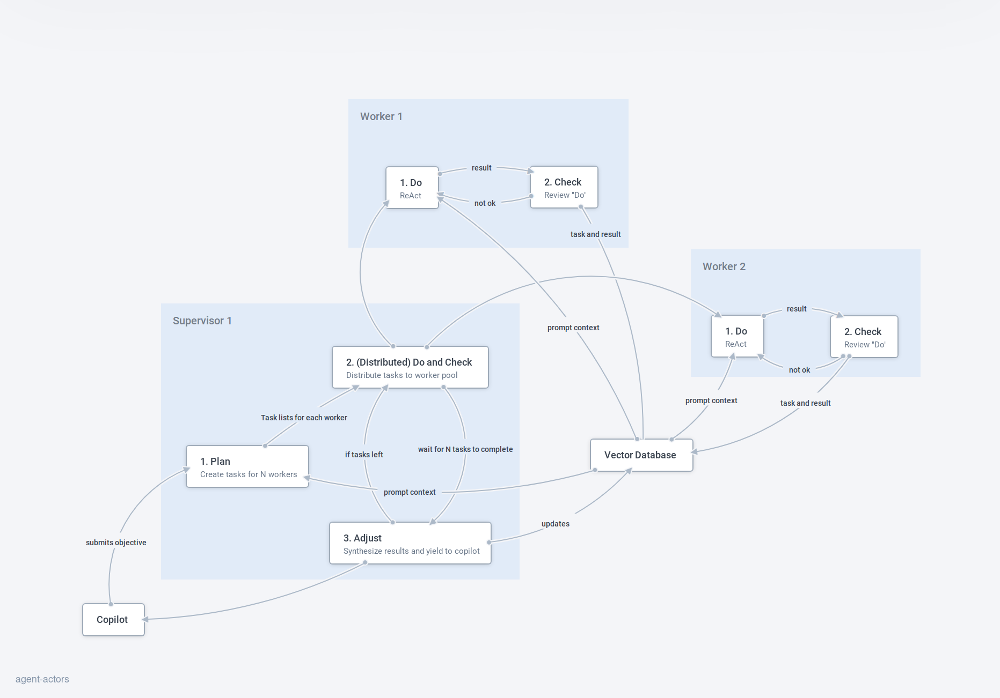

# agent-actors: The Potential of AGI with Plan-Do-Check-Adjust and the Actor Model of Concurrency

Welcome to agent-actors, a proof-of-concept Python project that demonstrates the possibilities of combining AGI proof-of-concepts like BabyAgent and AutoGPT with the Plan-Do-Check-Adjust (PDCA) cycle, as well as the actor model of concurrency for managing large language models (LLMs). agent-actors aims to inspire the LLM community, emphasizing the untapped potential of the actor model of concurrency as applied to generative agents and encouraging further exploration and development.

[](https://asciinema.org/a/R54NGynvBPeCXFlgBIBaYZ1cD)

## Key Features

* **Plan-Do-Check-Adjust (PDCA) Cycle**: The supervisory agent does, allowing for continuous improvement and optimization of the work distribution and execution process among worker agents.
* **Actor Model of Concurrency**: agent-actors implements the actor model, where a supervisor agent has worker agents that complete sub-tasks in parallel independently.
* **Agent Working Memory**: Agents have their own local working memory synthesized from a global memory store to inject into their prompts as context. Agents also score the relevance of their new memories (a la Generative Agents: Interactive Simulacra of Human Behavior)

## How it works



1. A copilot submits an objective to a **Supervisor**, along with a set of worker agents. The supervisor which makes a **Plan** and distributes the tasks to its worker agents.
2. **Workers** use the ReAct framework to **Do** a task with an added **Check** to improve their work if required.
3. **Supervisor** reviews the results of tasks in the **Adjust** phase and decides whether to loop back to planning or to terminate.

## Limitations

This was only tested on GPT-3.5-Turbo, and not GPT-4, because we don't have an API token.

## Request for Contributors

We invite contributors to join us in expanding agent-actors by exploring the following ideas:

1. **Improved Agent Prompts**: Develop better prompts for the Plan, Do, Check, and Adjust chains
2. **Visualization TOoling**: Develop an interface for exploring the execution tree of Agent Actors, allowing researchers to better understand and visualize the interaction between the supervisory agent and worker agents.
3. **Nested Supervisors**: Experiment with having nested supervision trees

## Acknowledgments

We extend our gratitude to the two Python packages, langchain and ray, which have significantly contributed to the development of agent-actors.

Together, let's explore the potential of Agent Actors and inspire the LLM community to delve deeper into this exciting area of research.

## Development

1. Clone the repo
2. `poetry install --with dev --with typing`

Make sure to run `poetry shell` to activate the virtual env!

### REPL-Driven Development

```bash
poetry run ipython
```

### Tests

```bash
poetry run pytest -s # run all tests
poetry run pytest -s -k 'thinking' # How can we ensure the safe development of Agent?
```

## License

BUSL-1.1

## Citation

Citation
Please cite the repo if you use the data or code in this repo.

```
@misc{agiactors,
  author = {Cyrus Nouroozi},
  title = {agent-actors: The Potential of Agent with Plan-Do-Check-Adjust and the Actor Model of Concurrency},
  year = {2023},
  publisher = {GitHub},
  journal = {GitHub repository},
  howpublished = {\url{https://github.com/shaman-ai/agent-actors}},
}
```
